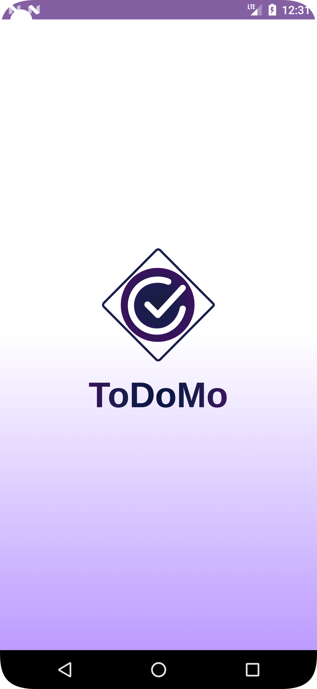
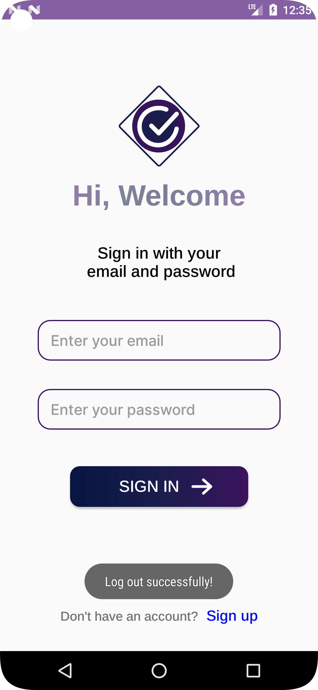
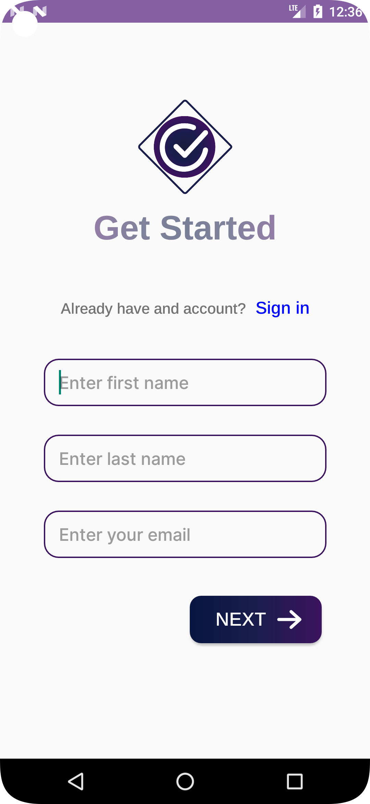
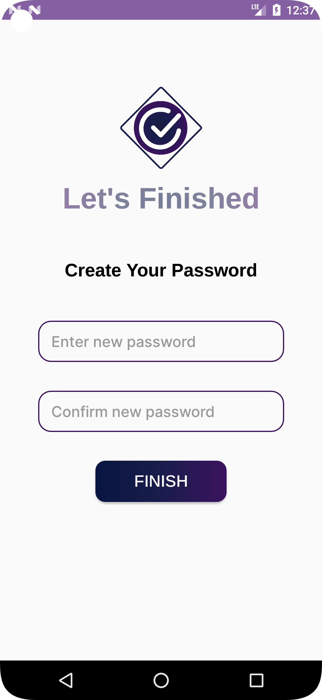
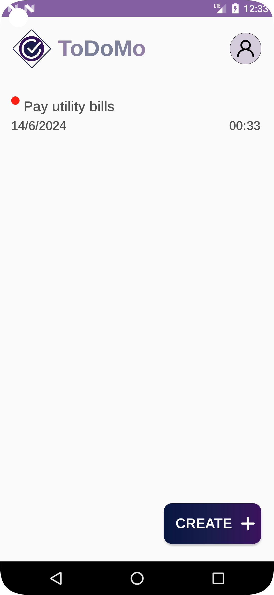
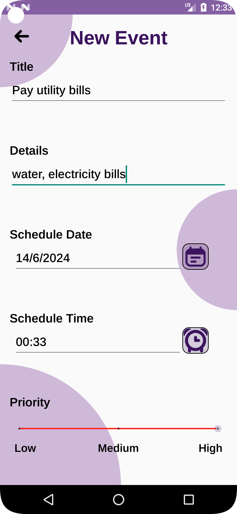
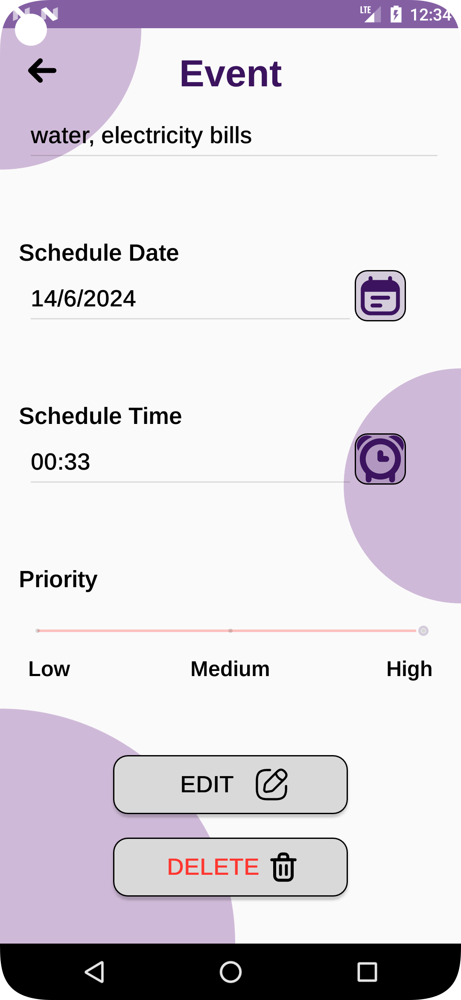
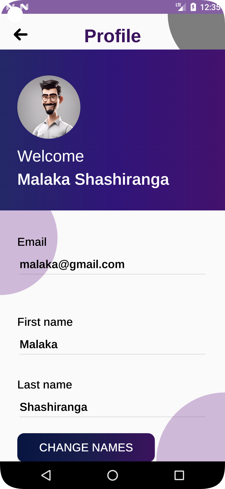
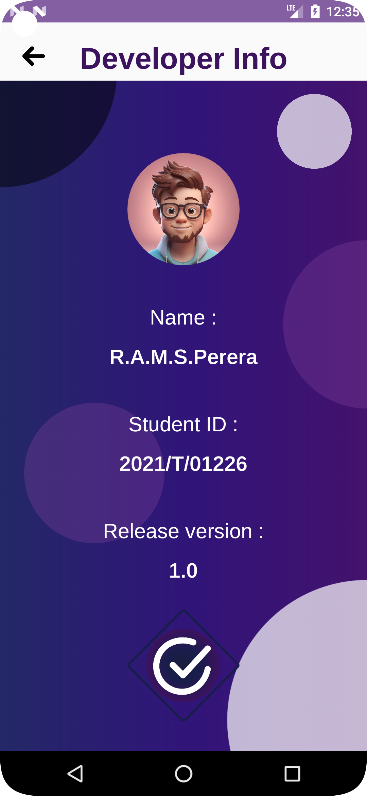

# ToDo-application

## Overview

**Purpose:** The purpose of this todo application is to provide users with a convenient way to manage their tasks and todos on their mobile devices. It aims to offer a seamless experience by leveraging Firebase Authentication for secure user authentication, SQLite for storing todo lists locally on the device, and SharedPreferences for remembering user logins and implementing logout functionality.

### Key Features:

1. **User Authentication with Firebase:** Users can securely sign up, log in, and authenticate using Firebase Authentication. This ensures a safe and reliable login experience with support for only email/password authentication method provided by Firebase.

2. **Local Storage with SQLite:** The application utilizes SQLite, a lightweight relational database, to store todo lists locally on the user's device. This allows users to access and manage their todos even when offline, ensuring data persistence and reliability.

3. **Todo List Management:**
    - **Add, Edit, Delete Todos:** Users can easily add new todos, edit existing ones, and delete completed or unnecessary todos.
    - **Prioritize Todos:** Users can prioritize todos by low, medium or high.

4. **Login Remembering with SharedPreferences:** The application remembers user logins using SharedPreferences, allowing users to stay logged in even after closing the app. This enhances user convenience and eliminates the need for repeated logins.

5. **Logout Functionality:** Users can securely log out of their accounts with the implemented logout functionality. This ensures privacy and security by terminating the current session and preventing unauthorized access to the user's account.

### Additional Enhancements:

- **User Profiles:** Implement user profiles where users can customize their personal information.


### Installation

1. Clone the repository:
   ```sh
   git clone https://github.com/malakashashiranga/ToDo-application.git

2. Open the project in Android Studio.
3. Build and run the application on your Android device or emulator.


## Screenshots

Here are some screenshots of the ToDo application:

### Splash Screen


*The initial splash screen that appears when the application is launched.*

### Sign In Screen


*The sign-in screen where users can log in using their email and password.*

### Sign Up - First Details


*The first part of the sign-up process where users enter their basic details.*

### Set Password


*The screen where users set their password during the sign-up process.*

### Home Screen


*The main screen displaying the list of todos and navigation options.*

### Add New Event


*The screen for adding a new task or event.*

### Update Event


*The screen for updating an existing task or event.*

### User Profile


*The user profile screen where users can view and edit their personal information.*

### Developer Info


*Information about the developer of the application.*

